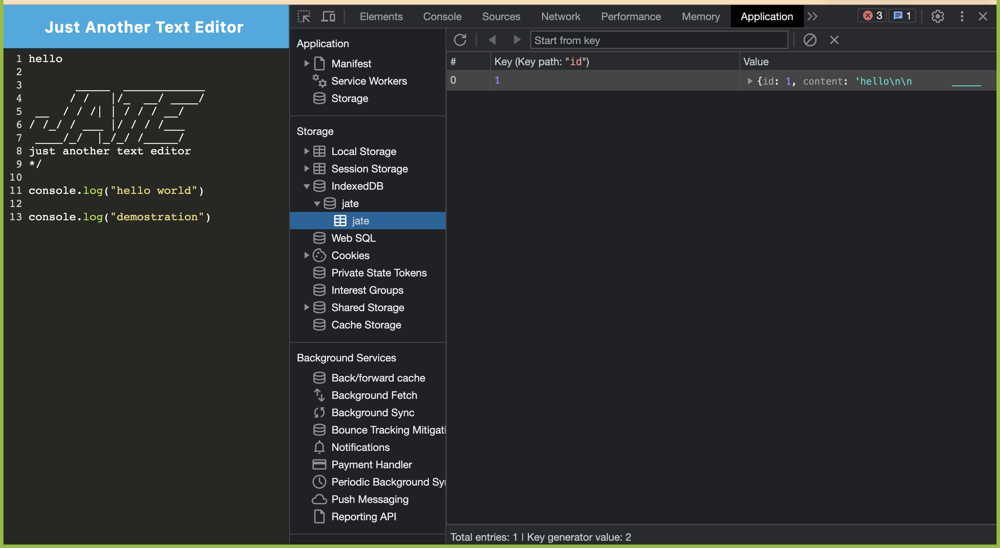
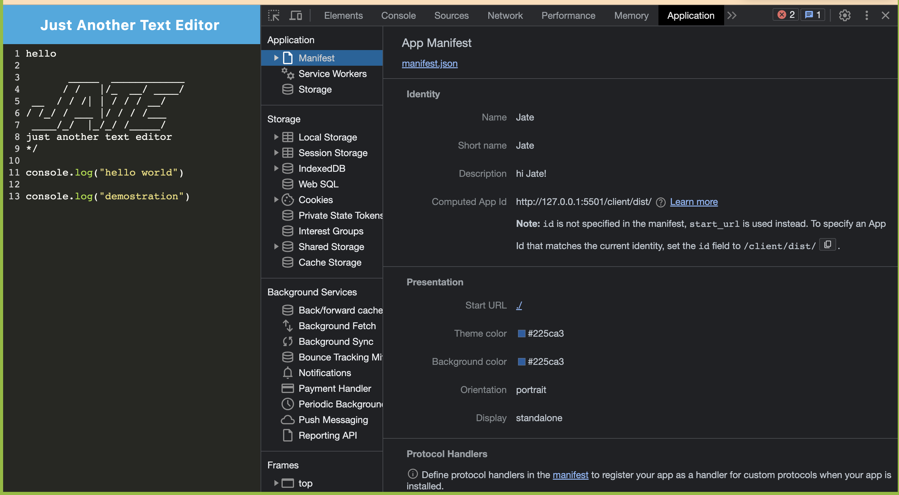
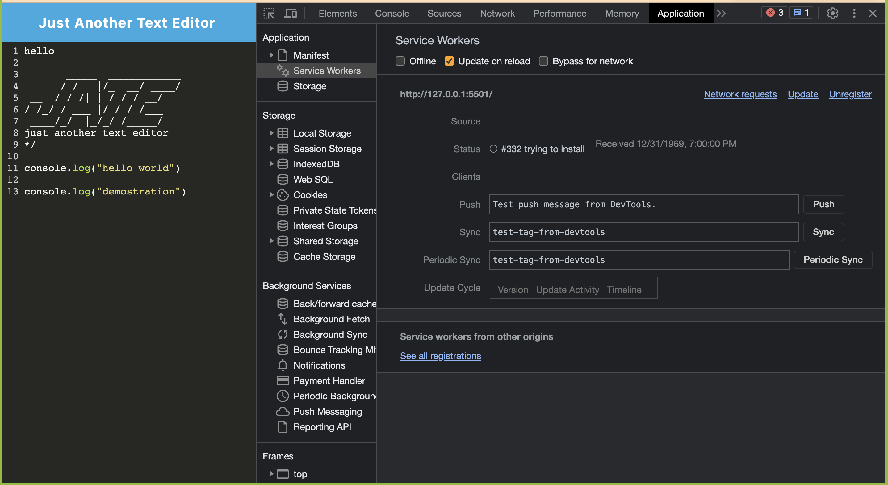

# myPwa_textEditor

This application is a single page text editor that meets the PWA criteria, it uses a data redundancy technique so that it can still works in case that the browser don't support one of its features, and the application will also work offline

This is the link for the website: https://still-gorge-08711-456e13964c94.herokuapp.com/ 
